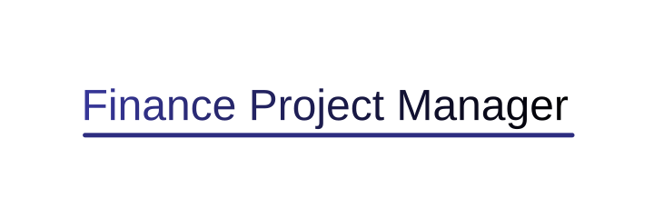

<div style="text-align: center" align="center">
  
</div>
<div style="text-align: center" align="center">
  <a href="https://github.com/luca-naujoks/fpm/actions?query=branch%3Adevelopment">
    
  </a>
</div>

A simple virtual budget-management application for tracking project finances.\
Built with Vite + SolidJS, Go, and SQLite.

## What you get?

- a single Binary
- minimal Resource footprint
- approximately 12MB in size

## Key Features

- **Project Management** — Create and manage multiple budget projects
- **Transaction Tracking** — Record income and expenses with descriptions and dates
- **Monthly Transactions** — Support for recurring monthly transactions
- **Budget Overview** — Track spending against project budgets

## Tech Stack

- **Frontend**: [Vite+SolidJS](https://www.solidjs.com) with SolidJS 2.0
- **Database**: SQLite with [Golang SQLite](https://pkg.go.dev/modernc.org/sqlite?utm_source=godoc)
- **Styling**: [Tailwind CSS](https://tailwindcss.com)

## Docker

Build from source and run with Docker:

```bash
# Clone the Git repository
git clone https://github.com/luca-naujoks/fpm.git

# Navigate into the Frontend directory
cd solid-web

# Build the Frontend
bun run build

# Navigate back into the Root directory
cd ..

# Build the image
docker build -t fpm .

# Run the container
docker run -p 80:80 fpm
```

## Docker Compose (optional)

```yaml
services:
  fpm:
    container_name: financial-project-manager
    image: ghcr.io/luca-naujoks/fpm:latest
    ports:
      - "80:80"
    volumes:
      - ./db:/app/db
    restart: unless-stopped
```

# Getting Started (Development)

You’ll run two processes during development:

1. Vite dev server in web-app/
2. main.go (Go backend) from the project root

## Prerequisites

- Node.js 18+ or Bun
- npm, yarn, pnpm, or bun
- Go 1.26+

## Installation

### 1. Clone the repository:

```zsh
   git clone https://github.com/luca-naujoks/fpm.git
   cd fpm
```

## 2. Run the Frontend

```zsh
    cd web-app
    # install dependencies (example using Bun)
    bun install
    
    # start dev server
    bun run dev
```

The frontend dev server runs on port 5173 by default.

## 3. Run the Golang Backend

Open a second terminal at the project root

```zsh
    # run the backend; restart this command after backend changes
    go run . 
```

### 4. Open the app

Open [http://localhost:5173](http://localhost:5173) in your browser.

## License

FPM is [MIT licensed](https://github.com/luca-naujoks/fpm/blob/master/LICENSE).
